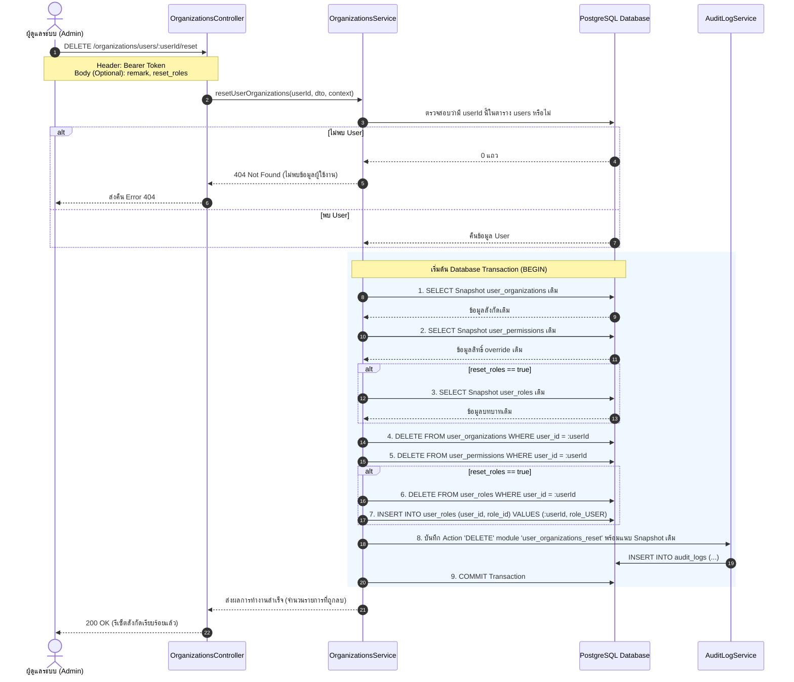

# 🔄 Flow การทำงาน: API รีเซ็ตสังกัดและสิทธิ์หน่วยงานของผู้ใช้งาน (Reset User Organizations)

เอกสารนี้อธิบายสถาปัตยกรรมและขั้นตอนการทำงานของ API:
`DELETE /organizations/users/:userId/reset`

---

## 🎯 1. วัตถุประสงค์ (Objective)
เพื่อถอดถอนผู้ใช้งานออกจาก **"สังกัดสาขา/หน่วยงานทั้งหมด"** (ทั้งสังกัดหลักและหน่วยงานเสริม) รวมถึงล้างสิทธิ์ย่อยระดับบุคคลที่เคย Override ไว้ ให้สถานะของผู้ใช้งานกลับไปเหมือน **"ผู้ใช้ใหม่ (New User)"** ที่เพิ่งล็อกอินเข้ามาในระบบครั้งแรก โดยที่บัญชีผู้ใช้งานไม่ถูกลบออกจากระบบ

---

## 🗄️ 2. ตารางที่เกี่ยวข้องและผลกระทบ (Database Impact)

| ลำดับ | ตารางใน Database | ผลการดำเนินการ | รายละเอียดข้อมูลที่ถูกลบ |
| :---: | :--- | :---: | :--- |
| **1** | **`user_organizations`** | 🗑️ **DELETE** | ลบทุกแถวที่ `user_id = :userId`<br>• หลุดจากสังกัดหลัก (`is_primary = 1`)<br>• หลุดจากสิทธิ์เข้าถึงหน่วยงานอื่นทั้งหมด (`is_primary = 0`) |
| **2** | **`user_permissions`** | 🗑️ **DELETE** | ลบทุกแถวที่ `user_id = :userId`<br>• ล้างสิทธิ์พิเศษ (Override) ที่เคยให้เป็นรายบุคคลสำหรับแต่ละหน่วยงาน |
| **3** | **`user_roles`** | ⚙️ **OPTIONAL** | *(กรณีส่ง `reset_roles: true`)*<br>• ลบ Role เดิมทั้งหมดแล้วใส่กลับเป็น `'USER'` (Default Role) |
| **4** | **`audit_logs`** | 📝 **INSERT** | บันทึกประวัติการทำรายการ โดยเก็บ **Snapshot ข้อมูลเดิมทั้งหมดก่อนถูกลบ** ไว้ในช่อง `old_data` เพื่อให้สามารถตรวจสอบย้อนหลังได้ |
| **5** | **`users`** | 🛡️ **SAFE** | **ไม่แตะต้อง** ข้อมูลบัญชีผู้ใช้งาน, ข้อมูล SSO, อีเมล และประวัติทั่วไปยังคงอยู่ 100% |
| **6** | **`organizations`** | 🛡️ **SAFE** | **ไม่แตะต้อง** โครงสร้างสาขาและหน่วยงานยังคงอยู่ตามเดิม |

---

## 🧭 3. Sequence & Flow Diagram



---

## 📡 4. ข้อมูลจำเพาะของ API (API Specification)

### **Endpoint:**
```http
DELETE /organizations/users/:userId/reset
```

### **Headers:**
```http
Authorization: Bearer <JWT_ACCESS_TOKEN>
Content-Type: application/json
```

### **Parameters:**
* **Path Parameter:**
  * `userId` (number, required): รหัส ID ของผู้ใช้งานที่ต้องการรีเซ็ต

* **Request Body (JSON, Optional):**
```json
{
  "remark": "เปลี่ยนสายงาน / ย้ายออกจากทุกหน่วยงาน",
  "reset_roles": false
}
```
| ฟิลด์ | ประเภท | ค่าเริ่มต้น | รายละเอียด |
| :--- | :---: | :---: | :--- |
| `remark` | string | `'รีเซ็ตสังกัดและสิทธิ์หน่วยงานทั้งหมดให้กลับสู่สถานะผู้ใช้ใหม่'` | หมายเหตุสำหรับบันทึกลง Audit Log |
| `reset_roles` | boolean | `false` | หากใส่เป็น `true` จะล้าง Roles ทั้งหมดแล้วปรับบทบาทกลับเป็น `USER` เริ่มต้น |

---

### **ตัวอย่าง Response สำเร็จ (200 OK):**
```json
{
  "status": true,
  "data": {
    "message": "รีเซ็ตสังกัดและสิทธิ์หน่วยงานของผู้ใช้งานเรียบร้อยแล้ว ผู้ใช้กลับสู่สถานะไม่มีสังกัด",
    "user_id": 10,
    "username": "somchai.d",
    "removed_organizations_count": 2,
    "removed_permissions_count": 5,
    "roles_reset": false
  }
}
```

---

## 🔒 5. ความปลอดภัยและ Audit Trail

1. **Transaction Integrity:** ดำเนินการผ่าน Transaction หากเกิดข้อผิดพลาดขั้นตอนใดขั้นตอนหนึ่ง ระบบจะทำการ `ROLLBACK` ทันที ข้อมูลจะไม่เสียหายหรือค้างครึ่งๆ กลางๆ
2. **Audit Logging:** ข้อมูลสังกัดเดิมทั้งหมดจะถูกจัดเก็บในรูป JSON ในตาราง `audit_logs` (Module: `user_organizations_reset`) ทำให้สามารถดูประวัติย้อนหลังได้ว่า ผู้ใช้คนนี้เคยอยู่สาขาใดหรือมีสิทธิ์อะไรบ้างก่อนถูกรีเซ็ต
